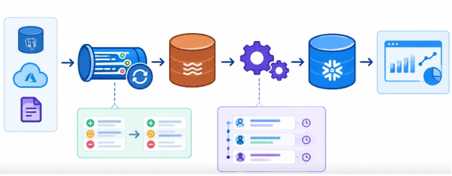
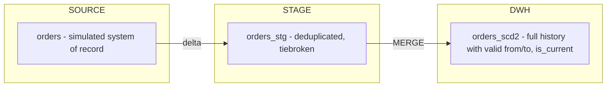

# **CDC-SCD2-pipeline-project**



**Image was generated by AI*

## Delta Loading with Indempotent MERGE

Welcome in my repository! This is my portfolio project which stimulates a real-world CDC (Change Data Capture) pipeline including inserts, updates and soft-deletes 
from a source system and historization of these changes in a SCD2 (Type 2 Slowly Changing Dimension) layer using Snowflake SQL.

### Why this project?

Loading a full snapshot of data into a warehouse is not that hard. The hard part (and what's really important in production environment) is correctly capturing
change over time: what changed, when, in what order and also how to store that history without losing information or creating duplicates in the data. It's 
extremely important, because then less data is processed, but also less data needs storage. And processing the data and storing it costs money, of course. 

This project builds a small, but complete CDC pipeline from scratch. It demonstrates:
- delta extraction from a changing source
- deduplication and tiebreaking when there are multiple changes to the same record arriving close together
- indempotent, MERGE logic which can be run again and again
- handling of late arriving data
- automated data quality tests (which are checking if validation of the historization is correct).

## Architecture of this project


### Source layer

A table simulating a transactional system. Procedure **simulate_changes** mutates it in cycles (insert, update, soft-delete), each change 
has a source-system **updated_at** timestamp. This stands for a real OLTP system emitting change events.

### Stage layer

Append-only landing of the delta since the last run. In this layer deduplication and tiebreaking are performed. In a situation where 
multiple changes arrive in one batch, only the correct (which means latest) version is kept, using an explicit, documented rule for resolving
**updated_at** collisions.

### DWH layer

A target table with historization. Each row represents one version of an entity. Each record has **valid_from / valid_to** and also 
**is_current** flag. The MERGE that loads this table is indempotent - it means that running it twice on the same batch won't create
duplicated history or corrupt existing records.

## Design - used trade-offs 

- **Soft deletes instead of hard deletes** - in real-world hard deletes are less likely. Usually a flag or an event are used instead of
  physical **DELETE**. Modeling **is_deleted** is my recreation of it.
  
- **Tiebreaking rule** - in a situation when two changes to the same business key have the same or very close **updated_at**, the rule
  used in this project is to pick "the winner" - the row with the highest source_seq, for example `ROW_NUMBER() OVER (PARTITION BY order_id ORDER BY source_seq DESC)`.
  I decided not to use just `updated_at` because it is based on `CURRENT_TIMESTAMP()`. Multiple statements executed within the same procedure call share the exact
  same timestamp. Then uniqueness is not guaranteed. This is how real CDC tools resolve ordering- not by human-readable timestamp. The actual source of truth is
  `source_seq` and `updated_at` is left in the model for readability and for business logic only.
  
- **Late-arriving data handling** - implemented as insert-in-place, scoped to a single boundary. If an incoming record's source_seq is chronologically somewhere
  between an existing SCD2 record's `valid_from` and `valid_to`, the existing record is closed early at the late record's position, and then late record is
  inserted with `valid_from`/`valid_to` to bounding it correctly on both sides. I didn't decide to *silently drop* late change, because it's the matter of
  processing timing and it's not the data fault. Building historization layer should be analytically trustworthy. Dropping late record is basically against this rule.
  
- **No-op change handling** - updates that don't actually change the data are filtered out before the MERGE - that's how I avoided
  creating meaningless history rows.

## Data quality tests

You can find them in `sql/04_tests/`:

| Test | Description |
|------|-------------|
| `test_no_duplicates_current.sql` | Check if there is exactly one `is_current = TRUE` row per business key |
| `test_no_overlapping_ranges.sql` | Checks the intervals of `valid_from`/`valid_to` - they can't be overlapping and there shouldn't be any gaps between them |
| `test_history_completeness.sql` | Checks if the number of historical rows is equal to number of source-side changes |

## Project structure

```
cdc-scd2-project/

├── README.md
├── LICENSE
├── docs/
|    └── architecture.md
├── sql/
|    ├── 00_setup/
|    ├── 01_source/
|    ├── 02_stage/
|    ├── 03_dwh/
|    ├── 04_tests/
└── run_pipeline/
     └── run_cycle.sql
```
## How to run this project on your machine

1. Run scripts in `sql/00_setup/` to create schemas.
2. Run `sql/01_source/create_source_table.sql` and in the next step call `simulate_changes_1` to generate an initial batch (it's like an initial load).
3. Run `sql/02_stage/` scripts to extract and deduplicate the delta.
4. Run `sql/03_dwh/merge_scd2.sql` to historize the delta into the SCD2 table.
5. Run `sql/04_tests/` to validate the result.
6. Call `simulate_changes_2', 'simulate_changes_3`, etc. and repeat steps 3-5 to observe historization over couple of cycles - or use `run_pipeline/run_cycle.sql`
   to run one full cycle end to end.

## Technological Stack

- Snowflake SQL (MERGE, stored procedures, streams-style delta handling)
  
- VS Code with the Snowflake extension.

## Goal of this project is to demonstrate:

- Understanding of CDC concepts beyond "loading data"
- SCD2 historization done the way it should be done including edge cases
- Indempotent, production-style MERGE logic
- Data quality testing as a part of the pipeline
  


